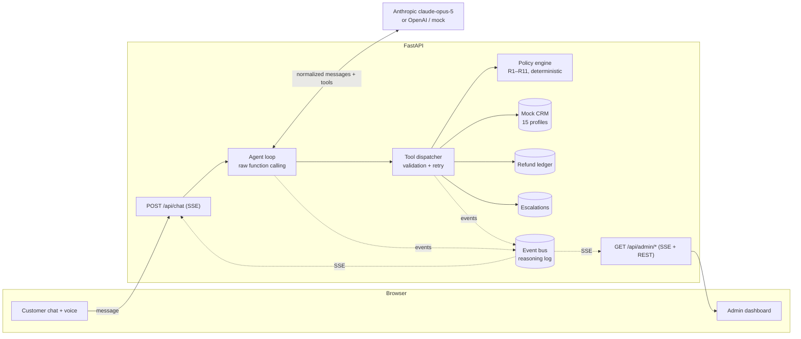

# Meridian Assist — AI Customer Support Agent

A fully functional web application in which an AI agent **processes or denies
e-commerce refunds** against a strict policy — with a customer chat + voice
interface, and an admin dashboard that streams the agent's reasoning in real
time.

The core design principle: **the LLM talks, deterministic code decides.** The
agent orchestrates conversation and tool use, but refund eligibility and
amounts are computed exclusively by a pure-Python policy engine that returns
rule citations. That is what lets the agent genuinely "hold the line" when a
customer pushes back — there is no prompt-injection path to an unearned refund.

## Features

- **Agent backend** — raw function-calling agent loop (no framework), built on
  the official Anthropic SDK (default model `claude-opus-5`), with an OpenAI
  adapter behind the same provider interface. The loop owns retries
  (exponential backoff, surfaced as events), tool-error recovery, a
  max-iteration guardrail, and safety-refusal handling.
- **Deterministic policy engine** — 11 numbered rules (R1–R11) implemented 1:1
  from [`refund_policy.md`](backend/app/data/refund_policy.md): return windows,
  damage claims, non-returnable categories, restocking fees, partial refunds,
  auto-approval limits, flagged accounts, carrier investigations, and
  pre-shipment cancellations. Every decision carries its rule citations.
- **Defense in depth** — `process_refund` re-runs the policy engine at
  execution time and computes the amount itself; the model can neither invent
  an amount nor execute an ineligible refund. Tool-level ownership checks stop
  cross-account data access, and explicit customer confirmation (R12) is
  enforced in code, not just in the prompt.
- **Mock CRM** — 15 seeded customer profiles, each engineered to exercise a
  different policy path. Dates are stored as day-offsets and hydrated at load
  time, so every scenario stays valid no matter when you run the demo.
- **Real-time reasoning log** — every LLM call, retry, tool call, tool result,
  policy decision, refund, escalation, and failure is emitted as a typed event
  and streamed over SSE to the admin dashboard (with filters, per-session
  views, and expandable JSON payloads).
- **Voice pipeline** — a mic button for speech-to-text (browser-native Web
  Speech API) and spoken agent replies via **ElevenLabs**, proxied through the
  backend so the API key never reaches the browser. If no ElevenLabs key is
  configured — or the call fails, or quota runs out — it degrades silently to
  the browser's built-in speech synthesis, so voice never breaks a demo.
- **Token streaming** — replies stream in as they are generated, with a typing
  indicator covering the gap before the first token. The provider interface has
  a non-streaming default, so an adapter that can't stream degrades to
  delivering the reply in one piece rather than breaking. A turn may stream a
  working note and *then* call a tool; that text is discarded and the
  authoritative reply is what gets committed.
- **Frontend** — customer chat with live agent status and the voice controls
  above, plus the admin dashboard: stat tiles, reasoning log, refund ledger,
  escalation tickets, CRM browser, and the policy document. A split view shows
  chat and reasoning side by side.
- **Tests** — 137 tests covering every policy rule, refund revalidation, the
  agent loop's retry/failure paths (via a scripted fake LLM), streaming
  (delta reassembly, tool-call fragments, the transient-event contract), and
  the HTTP API end to end (via the offline mock provider).

## Quickstart

Requirements: Python 3.11+ (no Node needed — the frontend is dependency-free
static ES modules served by the same process).

```bash
make setup                 # or: python3 -m venv .venv && .venv/bin/pip install -r backend/requirements.txt
cp .env.example .env       # then put your ANTHROPIC_API_KEY in .env
make dev                   # or: .venv/bin/uvicorn app.main:app --reload --app-dir backend --port 8000
```

Open **http://localhost:8000** — use *Split View* to watch the agent's
reasoning while you chat. `make test` runs the suite.

### Choosing an LLM

The `openai` provider speaks to **any OpenAI-compatible endpoint** via
`OPENAI_BASE_URL`, so the model is a one-line change. Every option below was
run against the full 15-scenario suite; the notes are measured, not guessed.

| Option | `.env` settings | Measured behaviour |
|---|---|---|
| **DeepSeek** (default) | `OPENAI_BASE_URL=https://api.deepseek.com` · `OPENAI_MODEL=deepseek-v4-flash` · `LLM_MAX_TOKENS=800` | 5–10s per turn, no rate ceiling, best hold-the-line phrasing. ~97% prompt-cache hit on the static prefix ⇒ well under $0.01 per turn. |
| **Groq** (free) | `OPENAI_BASE_URL=https://api.groq.com/openai/v1` · `OPENAI_MODEL=openai/gpt-oss-120b` · `LLM_MAX_TOKENS=400` | Fastest: 1–3s per turn. **100k tokens/day per model** (~11 turns) — but each model has its own budget, so switch models when one is spent. `llama-3.3-70b-versatile` is quicker still. |
| **Google Gemini** (free) | `OPENAI_BASE_URL=https://generativelanguage.googleapis.com/v1beta/openai` · `OPENAI_MODEL=gemini-flash-latest` | Works, but the free tier allows **20 requests/day** ≈ 5 agent turns. Fine to try, too small to rely on. |
| **Ollama** (fully local) | `OPENAI_BASE_URL=http://localhost:11434/v1` · `OPENAI_MODEL=gpt-oss:20b` · no key | No limits, fully offline. Set `OLLAMA_CONTEXT_LENGTH=16384` — the 4k default silently truncates the system prompt. |
| **Anthropic** | `LLM_PROVIDER=anthropic` + `ANTHROPIC_API_KEY` | `claude-opus-5` with prompt caching and the effort parameter. |

**Why the prompt is compact.** The system prompt and tool schemas are re-sent
on *every* call within a turn, so a 4-call turn pays for them four times. The
rule reference is therefore generated from the policy engine's own rule list
rather than embedding the full policy document, and tool schemas are stripped
of pydantic `title` noise. That cut a turn from ~15.4k tokens to ~9k — the
difference between constant rate-limiting and none on a free tier.

When a limit is hit anyway, the retry logic honours the provider's wait hint —
from the `Retry-After` header, or parsed out of the error body for providers
like Gemini that don't send one — and surfaces it as an `llm_retry` event in
the admin log.

No key at all? `LLM_PROVIDER=mock` runs a scripted offline provider that
exercises the full stack (clearly labeled, never used for real demos).

## Architecture



One turn = one `run_turn` call:

```
user message → [LLM call → tool calls → tool results]* → final reply
```

with every step emitted to the event bus. The chat endpoint streams the turn's
events (so the UI shows "Checking the refund policy engine…" live); the admin
endpoint streams all sessions' events with replay on connect.

**[`docs/architecture.html`](docs/architecture.html)** is an interactive visual
walkthrough of the whole system — open it in a browser (`open docs/architecture.html`).
It replays a real reasoning trace, maps the codebase with line counts, and lays out
the policy rules, failure matrix, and event model.

See [`docs/architecture.md`](docs/architecture.md) for the full design
(normalized message format, event taxonomy, failure-handling matrix, voice
pipeline and its upgrade path) and
[`docs/demo-script.md`](docs/demo-script.md) for a ready-made walkthrough
script.

## Demo scenarios

Each seeded profile triggers a specific policy path (also available in-app
under **Demo customers** and the admin **CRM** tab):

| Customer | Email | Order | Scenario → expected outcome |
|---|---|---|---|
| Sofia Ramirez | sofia.ramirez@example.com | ORD-72001 | Delivered 12d ago → **approved** (R1), $89.99 |
| James Okafor | james.okafor@example.com | ORD-72002 | Delivered 47d ago → **denied** (R1) — great "hold the line" demo |
| Mia Chen | mia.chen@example.com | ORD-72003 | Final-sale item → **denied** (R4) |
| Ethan Brooks | ethan.brooks@example.com | ORD-72004 | Gift card → **denied** (R5) |
| Lena Petrov | lena.petrov@example.com | ORD-72005 | Still in transit → **denied** (R2) |
| David Kim | david.kim@example.com | ORD-72006 | $649 machine → **human review** (R8) → escalation ticket |
| Grace Nwosu | grace.nwosu@example.com | ORD-72007 | Already refunded → **denied** (R7) |
| Henry Silva | henry.silva@example.com | ORD-72008 | Damaged on arrival (3d) → **approved incl. shipping** (R3) |
| Isabella Rossi | isabella.rossi@example.com | ORD-72009 | Flagged account → **human review** (R9) |
| Jack Thompson | jack.thompson@example.com | ORD-72010 | Two items, return gloves only → **partial refund** $25.00 |
| Kim Nguyen | kim.nguyen@example.com | ORD-72011 | Opened keyboard → **approved minus 15% fee** (R6), $109.65 |
| Liam Gallagher | liam.gallagher@example.com | ORD-72012 | Perishable → **denied** (R4) |
| Maya Patel | maya.patel@example.com | ORD-72013 | Not yet shipped → **cancel, full refund incl. shipping** (R10) |
| Noah Fischer | noah.fischer@example.com | ORD-72014 | "Delivered" but not received → **carrier investigation** (R11) |
| Olivia Laurent | olivia.laurent@example.com | ORD-72015 | Delivered 25d ago → **approved** (R1, window edge) |

To demo **failure handling & retries** live, set `DEMO_SIMULATE_CRM_OUTAGE=true`
in `.env` and restart: the first CRM lookup in each session fails with a
simulated timeout, and the reasoning log shows the `tool_retry` → recovery
sequence. Transient LLM errors (rate limits, 5xx) surface the same way as
`llm_retry` events with exponential backoff.

## Project structure

```
backend/
  app/
    main.py               FastAPI wiring: services, routes, static frontend
    config.py             Settings (.env), provider/model/effort/guardrails
    models.py             Domain models (Customer, Order, PolicyDecision, …)
    events.py             Typed reasoning-log events + pub/sub bus (SSE fan-out)
    agent/
      loop.py             The agent loop: retries, guardrails, event emission
      tools.py            5 tool specs (pydantic-validated) + dispatcher
      prompts.py          System prompt: protocol, hard rules, policy text
    llm/
      base.py             Provider interface + normalized message format
      anthropic_provider.py   Default (claude-opus-5, prompt caching, effort)
      openai_provider.py      Alternative provider
      mock_provider.py        Offline scripted provider (dev/tests only)
    services/
      crm.py              Mock CRM: seed hydration, lookups, ownership
      policy.py           Deterministic policy engine (R1–R11)
      refunds.py          Refund ledger: revalidation, confirmation gate
      escalations.py      Human-review tickets
      sessions.py         In-memory chat sessions
    data/
      customers.json      15 seeded CRM profiles (day-offset dates)
      refund_policy.md    The strict policy document (single source of truth)
  tests/                  137 tests: policy rules, ledger, loop, streaming, API
frontend/                 Dependency-free ES modules + CSS (no build step)
docs/                     architecture.md, demo-script.md
```

## Design decisions

- **Raw function calling over LangGraph/CrewAI** — the agent loop is ~150
  lines and fully inspectable: every retry, guardrail, and event emission is
  explicit application code rather than framework internals. For a
  policy-critical domain (refunds), that transparency is the feature.
- **Deterministic policy engine as tools** — LLMs are unreliable at rule
  arithmetic and can be socially engineered; a pure function cannot. The agent
  gathers facts conversationally, the engine decides, the agent communicates
  the decision with empathy — and cites the rules it was given.
- **Provider-agnostic LLM layer** — the loop speaks a small normalized message
  format; Anthropic/OpenAI adapters translate at the edge, and the OpenAI
  adapter doubles as a client for any OpenAI-compatible endpoint (DeepSeek,
  Groq, Gemini, Ollama). Swapping providers is a one-line `.env` change, and
  the same 15-scenario suite verifies each one. Provider quirks are absorbed
  here rather than leaking into the agent: tool calls are replayed verbatim so
  vendor-specific fields survive the round trip, and schemas are emitted in the
  JSON-Schema subset every provider accepts.
- **Visible failure handling** — SDK auto-retries are disabled on purpose;
  the loop owns retries so rate limits, timeouts, and recoveries appear in the
  admin reasoning log instead of happening silently.
- **Zero-build frontend** — static ES modules served by the same FastAPI
  process: the entire app runs with one command and no Node toolchain. The
  HTTP API is cleanly separated, so a React frontend could be swapped in
  without touching the backend.
- **Voice with a graceful ladder** — ElevenLabs for quality spoken replies,
  browser speech synthesis as an automatic fallback, and browser-native STT for
  input. The key stays server-side, and every failure mode (no key, bad voice
  ID, quota exhausted, network down) degrades instead of breaking.

## Configuration

| Variable | Default | Purpose |
|---|---|---|
| `LLM_PROVIDER` | `anthropic` | `anthropic` \| `openai` \| `mock` |
| `ANTHROPIC_API_KEY` | — | Required for the default provider |
| `ANTHROPIC_MODEL` | `claude-opus-5` | Any current Claude model |
| `LLM_EFFORT` | `low` | Claude reasoning effort (`low`/`medium`/`high`) |
| `OPENAI_API_KEY` / `OPENAI_MODEL` | — / `gpt-4o` | Used when `LLM_PROVIDER=openai` |
| `OPENAI_BASE_URL` | — | Any OpenAI-compatible endpoint (DeepSeek / Groq / Gemini / Ollama) |
| `LLM_MAX_TOKENS` | `16000` | Reply cap. Keep small on free tiers that pre-count it (Groq) |
| `LLM_RETRY_ATTEMPTS` | `3` | Visible retries for transient LLM failures |
| `MAX_TOOL_ITERATIONS` | `8` | Runaway-loop guardrail |
| `ELEVENLABS_API_KEY` | — | Enables ElevenLabs spoken replies (falls back to browser speech if unset) |
| `ELEVENLABS_VOICE_ID` | Bella | Voice to speak with — list yours via `GET /api/voices` |
| `ELEVENLABS_MODEL_ID` | `eleven_multilingual_v2` | TTS model |
| `DEMO_SIMULATE_CRM_OUTAGE` | `false` | Force one tool failure/retry per session |

## Limitations & next steps

Known and deliberate, with the reasoning:

- **In-memory state** — sessions, refund ledger, escalations, and the event log
  reset on restart. Convenient for repeated demo takes; a persistent DB is the
  first thing to add for real use.
- **No auth on the admin API** — the dashboard and its SSE stream are open. Fine
  for a local demo, unacceptable in production.
- **Free-tier concurrency** — two simultaneous conversations can exceed a free
  LLM tier's per-minute token budget. The loop retries (honoring `Retry-After`)
  and then degrades gracefully rather than erroring, but the demo is designed
  for one conversation at a time.
- **Client disconnect mid-turn cancels the turn.** If the browser goes away
  between `process_refund` and the reply, the refund is already in the ledger
  but the customer never sees the confirmation. A durable job queue is the
  production answer.
- **SKU is the line key.** An order with two lines sharing one SKU would be
  treated as a single line. No seed order does this; real systems key on a
  line ID instead.
- **Unbounded session history** — long conversations grow the prompt each turn.
  Context compaction or a rolling window is the next step.
- **Money as floats**, rounded at the boundary. Fine at these amounts;
  `Decimal` is the right call if this ever handles real money.

Token-level reply streaming is the other natural addition — the event stream
already provides live feedback, and the typed event model was designed so an
eval harness can replay reasoning traces offline.
