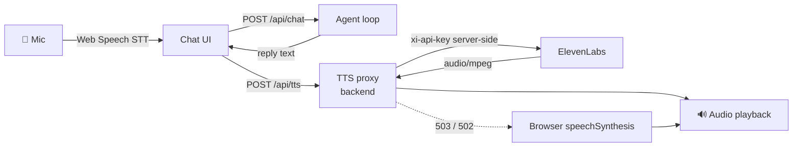

# Architecture

Deep-dive companion to the README. Code references are to `backend/app/`.

## Request lifecycle (one chat turn)

```mermaid
sequenceDiagram
    participant UI as Chat UI
    participant API as POST /api/chat (SSE)
    participant Loop as AgentRunner.run_turn
    participant LLM as Provider (Claude Opus 5)
    participant Tools as Tool dispatcher
    participant Engine as Policy engine
    participant Bus as Event bus

    UI->>API: {session_id, message}
    API->>Bus: subscribe (this turn)
    API->>Loop: run_turn(session, message)
    Loop->>Bus: user_message
    loop until final reply (max 8 iterations)
        Loop->>Bus: llm_request
        Loop->>LLM: system + normalized history + tool schemas
        alt transient failure (429 / 5xx / network)
            Loop->>Bus: llm_retry (backoff 1s→2s→4s + jitter)
        end
        LLM-->>Loop: text and/or tool_calls
        alt tool calls present
            Loop->>Bus: assistant_thinking (model's working note)
            Loop->>Tools: execute each call
            Tools->>Bus: tool_call
            Tools->>Engine: evaluate (for eligibility/process)
            Engine-->>Tools: PolicyDecision + rule citations
            Tools->>Bus: policy_decision / refund_processed / escalation_created
            Tools-->>Loop: results (errors returned as is_error, never raised)
            Loop->>Bus: tool_result / tool_error / tool_retry
        else final text
            Loop->>Bus: agent_response
        end
    end
    Loop->>Bus: run_completed (status, duration, token usage)
    Bus-->>API: events stream to client as SSE frames
    API-->>UI: live status → reply bubble
```

The admin dashboard holds a second, long-lived SSE connection
(`GET /api/admin/stream`) that replays the last 300 events on connect and then
receives every session's events live (client dedupes by event id on reconnect).

## Normalized message format (`llm/base.py`)

The loop and session history never touch provider wire formats:

```python
{"role": "user",      "content": str}
{"role": "assistant", "content": str | None, "tool_calls": [{id, name, arguments, raw}]}
{"role": "tool",      "results": [{tool_call_id, name, content, is_error}]}
```

Adapters translate at the edge — Anthropic packs tool results into a user turn
of `tool_result` blocks; OpenAI expands them into `role:"tool"` messages. A
provider returns an `LLMResponse {text, tool_calls, stop_reason, usage}` with
stop reasons normalized to `end_turn | tool_use | max_tokens | refusal`.

### Provider quirks are absorbed here, not in the agent

Four behaviours in this layer exist because a real provider demanded them, and
each was found by running the scenario suite against that provider:

- **Tool calls are replayed verbatim.** `ToolCallRequest.raw` keeps the
  provider's original object so it can be echoed back unchanged. Rebuilding a
  call from `name` + `arguments` drops vendor fields — Gemini's thinking models
  reject a follow-up whose tool calls lost their `thought_signature`.
- **Schemas are emitted in the common JSON-Schema subset.**
  `tools._portable_schema()` flattens `anyOf: [X, null]` (which pydantic emits
  for `Optional[...]`, and Gemini's function-calling subset rejects) and strips
  `title` keys, which no provider reads and every call pays for.
- **Retry hints come from the header *or* the error body.** Groq sends
  `Retry-After`; Gemini states the delay only in the message text. Without
  parsing both, a per-minute limit burns all attempts in seconds.
- **The provider's rate-limit message is preserved** in the event log — it names
  the exact quota (`tokens per day (TPD): Limit 100000`), which is the
  difference between diagnosing a limit and guessing at one.

Per-provider notes:
- **DeepSeek** (`deepseek-v4-flash`, current default) — 1M context, thinking
  mode on by default, and automatic prompt caching that hits ~97% on the static
  prefix. No free-tier ceiling.
- **Anthropic** — `claude-opus-5` with `output_config.effort` (`LLM_EFFORT`);
  the static system prompt carries an explicit `cache_control` breakpoint, and
  `stop_reason == "refusal"` is handled with a polite fallback rather than a crash.
- **All adapters** — SDK auto-retries are disabled, so the loop's retries are
  the only retries and each one is a visible `llm_retry` event.

## Event taxonomy (`events.py`)

| Event | Emitted by | Payload highlights |
|---|---|---|
| `session_started` | loop | provider, model |
| `user_message` | loop | text |
| `llm_request` | loop | iteration, attempt, provider, model |
| `llm_retry` | loop | attempt, delay_s, error |
| `response_delta` | loop | one fragment of the reply as it is generated — **transient**: fanned out live to the chat view, never written to the event history (a single reply produces hundreds and would evict the real trace from the bounded log). The admin stream drops them. |
| `assistant_thinking` | loop | the model's pre-tool working note |
| `tool_call` | dispatcher | tool, arguments |
| `tool_result` | dispatcher | tool, full result payload |
| `tool_retry` | dispatcher | tool, error, retry_delay_s |
| `tool_error` | dispatcher | tool, error (validation, lookup, blocked…) |
| `policy_decision` | eligibility / process handlers | phase, order_id, full `PolicyDecision` |
| `refund_processed` | process handler | full refund record |
| `escalation_created` | escalate handler | full ticket |
| `agent_response` | loop | final reply text |
| `run_error` | loop | kind: refusal / llm_exhausted / max_iterations / unexpected |
| `run_completed` | loop | status, iterations, duration_ms, token usage |

Events are the single source of truth for the admin UI (stat tiles are derived
server-side in `/api/admin/stats`) and would be the substrate for offline eval
replay.

## Policy engine mapping (`services/policy.py`)

| Rule | Implementation |
|---|---|
| R1 30-day window | `_evaluate_change_of_mind` — days since delivery gate |
| R2 delivery required | early status gate (`in_transit`/`processing`) |
| R3 damage/defect/wrong item ≤7d, full + shipping | `_evaluate_seller_fault` |
| R4 final-sale & perishable | per-item assessment |
| R5 gift cards | per-item assessment |
| R6 opened electronics −15% / used denied | per-item assessment + fee math |
| R7 no double refunds | `Order.refunded_skus()` checked in every path |
| R8 >$400 → human review | `_apply_review_gates` |
| R9 flagged accounts → human review | `_apply_review_gates` (flag never shown to the LLM) |
| R10 pre-shipment cancellation | `_evaluate_cancellation` |
| R11 not-received → investigation | dedicated branch |
| R12 verify / check / confirm / method | enforced procedurally: prompt protocol + `ConfirmationRequiredError` + ledger revalidation |

Design invariant: **`PolicyDecision` is the only source of refund amounts.**
`RefundLedger.process_refund` re-runs the engine at execution time
(defense in depth), so a manipulated or hallucinating model cannot execute an
ineligible refund — the attempt surfaces as a `policy_decision` (blocked) event
and an error result the model must relay.

## Failure-handling matrix

| Failure | Detection | Behavior | Visible as |
|---|---|---|---|
| LLM rate limit / 5xx / network | `TransientLLMError` from adapter | retry ×3, exponential backoff + jitter | `llm_retry`, then `run_error(llm_exhausted)` + graceful apology if exhausted |
| Transient tool failure (e.g. simulated CRM timeout) | `TransientToolError` | one retry after 0.4s | `tool_retry` |
| Bad tool arguments from the model | pydantic validation | error result returned to model to self-correct | `tool_error` |
| Unknown customer / wrong order owner / unknown SKU | service lookups | recoverable error result (no data leak) | `tool_error` |
| Ineligible refund attempt | ledger revalidation | blocked with rule citations, model must relay | `policy_decision` + `tool_error` |
| Runaway tool loop | iteration counter | stop at `MAX_TOOL_ITERATIONS`, hand off to human | `run_error(max_iterations)` |
| Model safety refusal | `stop_reason == "refusal"` | canned safe reply | `run_error(refusal)` |
| Unexpected exception | catch-all in loop | apology reply, server stays up | `run_error(unexpected)` |

Every turn — success or failure — terminates the SSE stream with
`run_completed`, so the chat UI can never hang on a dead turn.

## Voice pipeline



**Speech-to-text** (`frontend/js/voice.js`) — `SpeechRecognition` with interim
results; the final transcript auto-sends the message, giving hands-free turn
taking. Browser-native, so no key and no audio ever leaves the machine.

**Text-to-speech** — two engines behind one `speak()` call:

| Engine | When it's used | Notes |
|---|---|---|
| ElevenLabs | `ELEVENLABS_API_KEY` is set | `POST /api/tts` → `services/tts.py` → ElevenLabs convert endpoint → MP3 back to the browser |
| `speechSynthesis` | no key, or any ElevenLabs failure | Automatic fallback; a console warning names the reason |

Design points worth noting:

- **The API key never reaches the browser.** Synthesis is proxied by our own
  endpoint (`api/voice.py`), the same pattern you'd need in production.
- **Failures degrade, they don't break.** A missing key returns 503 and a
  provider error returns 502; the client treats both as "use browser speech."
  Blocked autoplay is caught the same way. The demo cannot lose its voice.
- **Quota is bounded** — `MAX_CHARS` caps a single utterance so a runaway
  input can't burn a free-tier allowance.
- **Voice discovery** — `GET /api/voices` lists the voices on the configured
  account, so `ELEVENLABS_VOICE_ID` can be set without guessing.

Further upgrade path (no agent changes required — the API is transport-neutral):
**OpenAI Realtime / LiveKit full duplex** — add a WebRTC session for audio I/O
and bridge its transcript stream into `POST /api/chat` turns; or invert it and
register this backend's five tools as Realtime session tools, since they are
plain JSON-schema functions and port unchanged.

## Deliberate scope boundaries

In-memory stores (reset on restart — a feature for repeatable demos), no auth
on admin routes, no token-level streaming (the reasoning-event stream already
provides live feedback; per-token deltas would add provider-specific streaming
paths). Production hardening order: Postgres for CRM/ledger/events → auth →
token streaming → offline eval harness replaying recorded event traces.
